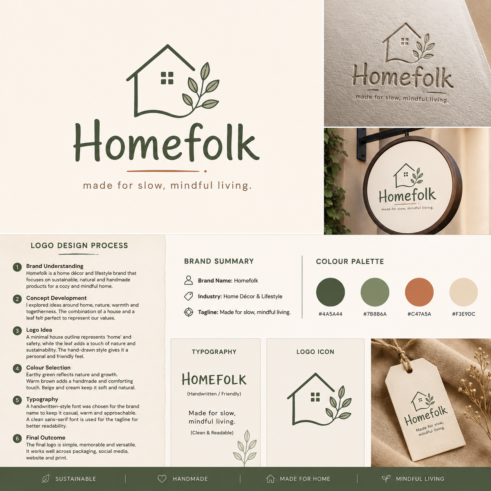

# SKILLCRAFT-TECHNOLOGY-TASK2 🎨

## Task 2 Completed | Logo Design

Sharing my second task from my Graphic Design Internship at SkillCraft Technology.

### 🏠 Project Overview: Homefolk Brand Identity

For this task, I developed a **logo and basic brand identity** for **Homefolk** — a home décor and lifestyle concept built around sustainable, handmade, and mindful living.

The idea was to create something that feels warm, simple, and connected to home. I used a house outline to represent comfort and belonging, while the leaf element reflects nature, sustainability, and the eco-conscious values of the brand.

#### 🎨 Brand Logo Preview

The design showcases:
- **Main Logo Variations** - Primary design with house icon and leaf motif
- **Embossed/Metallic Version** - Premium brand presentation
- **Circular Badge Design** - Versatile badge application
- **Real-World Mockups** - Product packaging and signage applications

---

#### 📊 Logo Design Process (6 Steps)

1. **Brand Understanding** 
   - Homefolk as a sustainable, handmade home décor lifestyle brand
   - Focus on natural, eco-conscious, and mindful living products

2. **Concept Development**
   - Explored themes of home, nature, warmth, and togetherness
   - Combined house outline with leaf element as core symbols

3. **Logo Idea**
   - Minimal house outline representing 'home' and safety
   - Leaf adds touch of nature and sustainability
   - Handwritten-style typography for personal, friendly feel

4. **Colour Selection**
   - Earthy greens reflect nature and growth
   - Warm brown adds handmade and comforting touch
   - Beige and cream keep it soft and natural

5. **Typography**
   - Handwritten-style font for brand warmth and approachability
   - Clean sans-serif for tagline readability and clarity

6. **Final Outcome**
   - Simple, memorable, and versatile logo
   - Works across packaging, social media, website and print

#### 🎯 Brand Identity Elements

**Color Palette:**
- 🌿 Dark Green (#4A5A44) - Nature and growth
- 🌱 Sage Green (#7B8B6A) - Calm and sustainability
- 🤎 Warm Brown (#C47A5A) - Handmade and comfort
- 🍃 Soft Cream (#F3E9DC) - Natural and soft feel

**Tagline:**
*"Made for slow, mindful living."*

**Typography:**
- **Brand Name Font**: Handwritten-style (Friendly)
- **Tagline Font**: Clean & Readable (Sans-serif)
- Creates an authentic, artisanal, approachable aesthetic

#### 🎨 Design Rationale

**Key Design Decisions:**
- **House Icon**: Represents comfort, belonging, safety, and home sanctuary
- **Leaf Element**: Symbolizes sustainability, nature, eco-consciousness, and growth
- **Organic Shapes**: Convey handmade, natural, and authentic elements
- **Warm Tones**: Evoke feelings of warmth, welcome, and coziness
- **Handwritten Typography**: Creates personal, friendly, and human brand voice

**Design Goals:**
- ✨ Create a memorable and distinctive brand identity
- ✨ Communicate the brand's values of sustainability and mindfulness
- ✨ Develop a cohesive visual language across all touchpoints
- ✨ Make the brand feel approachable, warm, and authentic

#### 📱 Brand Applications

The logo works beautifully across multiple formats:
- 📦 **Product Packaging** - Boxes, bags, wrapping
- 🏷️ **Gift Tags & Labels** - Product labels and tags
- 🪟 **Storefront Signage** - Shop windows and signs
- 📱 **Social Media** - Instagram, Pinterest, Facebook
- 🌐 **Website & Digital** - Web presence and digital marketing
- 📄 **Print Materials** - Brochures, flyers, business cards
- 🏠 **Interior Applications** - Wall signs, merchandise displays

#### 🛠️ Tools Used

- **Canva** - Main design platform for logo creation and branding
- **Freepik** - Icons, illustrations, and design elements
- **Adobe Suite** (Optional) - For refinements and high-resolution variations

#### 💡 Key Learnings

This project gave me valuable insights into brand design:
- How **icon design and symbolism** communicate brand values effectively
- The importance of **color psychology** in brand messaging and emotional connection
- How **typography choices** directly affect brand personality and perception
- How to create **cohesive visual systems** that tell a compelling brand story
- The value of **versatility** in logo design across different applications and formats
- Understanding **sustainability messaging** in modern branding

#### 🏷️ Brand Values

- **🌍 Sustainable** - Eco-conscious design and values
- **❤️ Handmade** - Authentic, artisanal aesthetic
- **🏡 Made for Home** - Comfort and belonging
- **🧘 Mindful Living** - Intentional and purposeful approach

#### 🏷️ Hashtags

#GraphicDesign #LogoDesign #BrandIdentity #HomeDecor #SustainableDesign #Branding #CanvaDesign #DesignInternship #SkillCraftTechnology #CreativeJourney #MindfulLiving #HandmadeDesign #BrandDesign #DesignThinking #BrandStrategy

---

**Designed by:** Sweta Kumari  
**Company:** SkillCraft Technology  
**Date:** June 2026  
**Repository:** [SKILLCRAFT-TECHNOLOGY-TASK2](https://github.com/SWETA-CSE/SKILLCRAFT-TECHNOLOGY-TASK2)

*"Design tells a story. Every choice matters."* ✨
